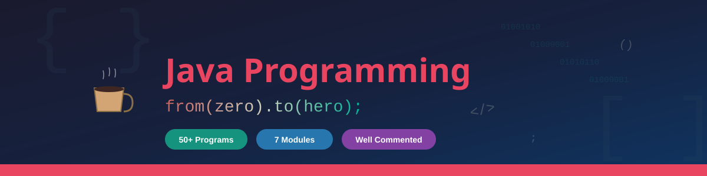
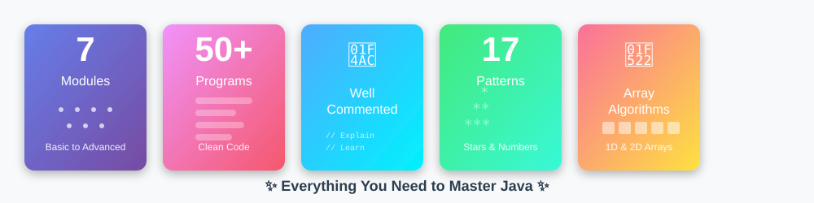
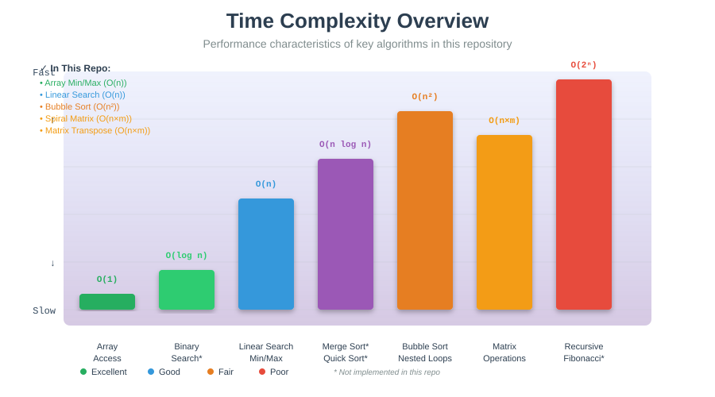

<div align="center">



# Java Programming — From Zero to Hero ☕🚀

**A structured, topic-wise collection of Java programs covering fundamentals, problem-solving & interview prep**

[](https://www.java.com/)
[](#-repository-structure)
[](#-topics--programs-at-a-glance)
[](https://github.com/)

Every program is **well-commented** with clear explanations — learn the _what_, the _why_, and the _how_.

[Explore Topics](#-topics--programs-at-a-glance) · [Get Started](#-getting-started) · [Resources](#-additional-resources) · [Contribute](#-contributing)

</div>

---

## 📌 Highlights

<div align="center">

</div>

| | Feature |
|---|---|
| 📘 | **7 topic modules** — from Hello World to recursion & string manipulation |
| 🧩 | **50+ programs** — each solving a specific problem with clean, readable code |
| 💬 | **Commented code** — inline explanations for every key concept |
| 📐 | **17 pattern programs** — stars, numbers, hollow shapes, diamonds & more |
| 🔢 | **Array algorithms** — spiral traversal, transpose, search in 2D, min/max |
| 📝 | **Handwritten notes & cheatsheets** — PDF resources for quick revision |

---

## 📂 Repository Structure

```
Java/
├── basic/                          # Module 1 — Java Fundamentals
│   ├── helloWorld.java             # First program — printing output
│   ├── variable.java               # All 8 primitive data types explained
│   ├── constant.java               # Using `final` keyword for constants
│   ├── input.java                  # Scanner class — reading user input
│   ├── typeCasting.java            # Implicit & explicit type casting
│   └── addtion.java                # Basic arithmetic with Scanner
│
├── array/                          # Module 2 — Arrays & Matrices
│   ├── takeInput.java              # Taking 1D array input from user
│   ├── takeInput2D.java            # Taking 2D array input from user
│   ├── minMax.java                 # Find minimum & maximum in an array
│   ├── ascendingOrder.java         # Sort array in ascending order
│   ├── searchXInArray.java         # Linear search in 1D array
│   ├── searchIn2DArray.java        # Search element in 2D array
│   ├── spiralOrderMatrix.java      # Spiral order traversal of a matrix
│   └── transposeIn2D.java          # Transpose of a 2D matrix
│
├── function/                       # Module 3 — Functions & Methods
│   ├── factorial.java              # Factorial of a number
│   ├── Fibonacci.java              # Fibonacci series of n terms
│   ├── power.java                  # Calculate x raised to power n
│   ├── average.java                # Average of numbers
│   ├── age.java                    # Age calculator
│   ├── Circumference.java          # Circumference of a circle
│   ├── findingGreater.java         # Find greater of two numbers
│   ├── greatestCommonDivisor.java  # GCD of two numbers
│   └── sumOdd.java                 # Sum of odd numbers
│
├── loops/                          # Module 4 — Loops & Control Flow
│   ├── count.java                  # Basic counting with loops
│   ├── evenodd.java                # Check even or odd
│   ├── allEvenNo.java              # Print all even numbers
│   ├── sumOfNaturalNo.java         # Sum of first N natural numbers
│   ├── checkPrimeNo.java           # Prime number check
│   ├── palindrome.java             # Palindrome number check
│   ├── marks.java                  # Grade calculator from marks
│   ├── makeCalculator.java         # Calculator using switch-case
│   └── makeCalender.java           # Month name from number (switch-case)
│
├── pattern/                        # Module 5 — Pattern Printing (17 patterns)
│   ├── rectangle.java              # Solid rectangle
│   ├── hollowrectangle.java        # Hollow rectangle
│   ├── halfpyramid.java            # Half pyramid (stars)
│   ├── imagehalfpyramid.java       # Half pyramid (variant)
│   ├── invertedhalfpyramid.java    # Inverted half pyramid
│   ├── imageInvertedHalfPyramid.java # Inverted half pyramid (variant)
│   ├── numhalfpyramid.java         # Number half pyramid
│   ├── numinvertedhalfpyramid.java # Number inverted half pyramid
│   ├── binaryhalfpyramid.java      # Binary (0/1) half pyramid
│   ├── numberpyramid.java          # Full number pyramid
│   ├── floydtriangle.java          # Floyd's triangle
│   ├── butterflypattern.java       # Butterfly pattern
│   ├── hollobutterfly.java         # Hollow butterfly
│   ├── hollowButterfly.java        # Hollow butterfly (variant)
│   ├── diamondpattern.java         # Diamond pattern
│   ├── palindromicpattern.java     # Palindromic number pattern
│   └── rhombuspattern.java         # Rhombus pattern
│
├── recursion/                      # Module 6 — Recursion
│   └── sumOfNaturalNumber.java     # Sum of N natural numbers (recursive)
│
├── strings/                        # Module 7 — String Manipulation
│   ├── reverseString.java          # Reverse a string (multiple methods)
│   └── reverseInteger.java         # Reverse an integer
│
├── assets/                         # Images & visual resources
│   ├── java-hero-banner.svg
│   ├── features-showcase.svg
│   ├── module-icons.svg
│   ├── learning-roadmap.svg
│   └── complexity-chart.svg
│
├── addtion.java                    # Quick addition program
├── JAVA UNIT 1.pdf                 # Unit 1 theory notes
├── Java_ArrayList_Cheatsheet.pdf   # ArrayList cheatsheet
├── Java Cheatsheet _ CodeWithHarry.html  # Comprehensive Java cheatsheet
└── README.md
```

---

## 🎯 Topics & Programs at a Glance


### 1️⃣ Java Basics

| Program | Concept Covered | Key Takeaway |
|---------|:---------------:|:------------:|
| `helloWorld.java` | Output & `main` method | `System.out.println()` |
| `variable.java` | All 8 primitive data types | `byte`, `short`, `int`, `long`, `float`, `double`, `boolean`, `char` |
| `constant.java` | Constants with `final` | Immutable variables |
| `input.java` | Scanner class | Reading `String`, `int`, `float`, `double`, `char` |
| `typeCasting.java` | Type conversion | Implicit (widening) & explicit (narrowing) casting |
| `addtion.java` | Arithmetic operations | Scanner-based input & output |

### 2️⃣ Arrays & Matrices

| Program | Description | Complexity |
|---------|:-----------:|:----------:|
| `minMax.java` | Find min & max using `Integer.MIN_VALUE` / `MAX_VALUE` | `O(n)` |
| `ascendingOrder.java` | Sort array in ascending order | `O(n²)` |
| `searchXInArray.java` | Linear search for an element | `O(n)` |
| `searchIn2DArray.java` | Search in a 2D matrix | `O(n × m)` |
| `spiralOrderMatrix.java` | Spiral order traversal with boundary pointers | `O(n × m)` |
| `transposeIn2D.java` | Matrix transpose | `O(n × m)` |

### 3️⃣ Functions & Methods

| Program | Description |
|---------|:-----------:|
| `factorial.java` | Calculate n! using iterative approach |
| `Fibonacci.java` | Print Fibonacci series up to n terms |
| `power.java` | Calculate x^n |
| `greatestCommonDivisor.java` | GCD of two numbers using brute-force |
| `Circumference.java` | Circumference of a circle (2πr) |
| `sumOdd.java` | Sum of odd numbers in a range |
| `average.java` | Calculate average |
| `findingGreater.java` | Find the greater of two numbers |

### 4️⃣ Loops & Control Flow

| Program | Description | Concept |
|---------|:-----------:|:-------:|
| `sumOfNaturalNo.java` | Sum of first N natural numbers | `for` loop |
| `checkPrimeNo.java` | Check if a number is prime | `for` loop with `break` |
| `evenodd.java` | Check even or odd | `if-else`, modulo |
| `allEvenNo.java` | Print all even numbers up to N | `for` loop |
| `palindrome.java` | Check palindrome number | `while` loop |
| `makeCalculator.java` | Basic calculator (+, −, ×, ÷, %) | `switch-case` |
| `makeCalender.java` | Print month name from number | `switch-case` |
| `marks.java` | Grade from marks | Conditional logic |

### 5️⃣ Pattern Printing

| Pattern | Program | Visual |
|---------|:-------:|:------:|
| Solid Rectangle | `rectangle.java` | `****` |
| Hollow Rectangle | `hollowrectangle.java` | `*  *` |
| Half Pyramid | `halfpyramid.java` | `* ** ***` |
| Inverted Half Pyramid | `invertedhalfpyramid.java` | `*** ** *` |
| Number Half Pyramid | `numhalfpyramid.java` | `1 12 123` |
| Binary Half Pyramid | `binaryhalfpyramid.java` | `1 01 101` |
| Floyd's Triangle | `floydtriangle.java` | `1 2 3 4 5 6` |
| Full Number Pyramid | `numberpyramid.java` | `  1  121 12321` |
| Butterfly | `butterflypattern.java` | `*  * ** * **` |
| Hollow Butterfly | `hollobutterfly.java` | Butterfly with hollow center |
| Diamond | `diamondpattern.java` | `  *  *** *****` |
| Palindromic Pattern | `palindromicpattern.java` | Symmetric number triangle |
| Rhombus | `rhombuspattern.java` | Shifted rectangle |

### 6️⃣ Recursion

| Program | Description | Approach |
|---------|:-----------:|:--------:|
| `sumOfNaturalNumber.java` | Sum of first N natural numbers | Recursive: `n + sum(n-1)`, base case `n == 0` |

### 7️⃣ Strings

| Program | Description | Technique |
|---------|:-----------:|:---------:|
| `reverseString.java` | Reverse a string | `StringBuilder.reverse()` + manual loop methods |
| `reverseInteger.java` | Reverse digits of an integer | Modulo & division |

---

## 📊 Complexity Quick Reference

<div align="center">

</div>

| Algorithm / Technique | Time | Space |
|----------------------|:----:|:-----:|
| Linear Search | `O(n)` | `O(1)` |
| Find Min / Max | `O(n)` | `O(1)` |
| Spiral Matrix Traversal | `O(n × m)` | `O(1)` |
| Matrix Transpose | `O(n × m)` | `O(n × m)` |
| Bubble Sort (Ascending) | `O(n²)` | `O(1)` |
| Factorial (Iterative) | `O(n)` | `O(1)` |
| Fibonacci (Iterative) | `O(n)` | `O(1)` |
| GCD (Brute-force) | `O(min(a,b))` | `O(1)` |
| Sum of N (Recursive) | `O(n)` | `O(n)` stack |
| String Reverse (StringBuilder) | `O(n)` | `O(n)` |

---

## 🚀 Getting Started

### Prerequisites

- **Java** JDK 8+ — [Download](https://www.oracle.com/java/technologies/downloads/)
- Any IDE or text editor (VS Code, IntelliJ, Eclipse)

### Run any program

```bash
# Navigate to the topic folder
cd basic

# Compile
javac helloWorld.java

# Run
java helloWorld
```

### Example output

```
Hello
```

---

## 🧠 How This Repo Is Organized

Each topic is in its own folder. Programs follow a consistent style:

```java
import java.util.*;

public class programName {
    // Helper method with clear name
    public static void solve(int n) {
        // Step-by-step logic with inline comments
    }

    public static void main(String[] args) {
        Scanner sc = new Scanner(System.in);
        // Take input → call method → print output
    }
}
```

> **Tip:** Read the comments inside each file — they explain the logic, edge cases, and alternative approaches.

---

## 📖 Additional Resources

| Resource | Description |
|----------|-------------|
| `JAVA UNIT 1.pdf` | Core Java theory notes (Unit 1) |
| `Java_ArrayList_Cheatsheet.pdf` | Quick reference for ArrayList operations |
| `Java Cheatsheet _ CodeWithHarry.html` | Comprehensive Java cheatsheet (offline HTML) |

---

## 🗺️ Learning Roadmap


```
Start Here
    │
    ▼
┌──────────┐    ┌───────────┐    ┌───────────┐
│  basic/  │───▶│  loops/   │───▶│ function/ │
│ Syntax & │    │ Control   │    │ Methods & │
│ I/O      │    │ Flow      │    │ Reuse     │
└──────────┘    └───────────┘    └───────────┘
                                       │
                                       ▼
┌──────────┐    ┌───────────┐    ┌───────────┐
│ strings/ │◀───│  array/   │◀───│ pattern/  │
│ String   │    │ Arrays &  │    │ Nested    │
│ Methods  │    │ Matrices  │    │ Loops     │
└──────────┘    └───────────┘    └───────────┘
                                       │
                                       ▼
                               ┌───────────┐
                               │recursion/ │
                               │ Recursive │
                               │ Thinking  │
                               └───────────┘
```

---

## 📈 Repository Statistics

<div align="center">

| 📊 Metric | 🔢 Count |
|-----------|:--------:|
| **Total Programs** | 50+ |
| **Code Lines** | ~3,500+ |
| **Pattern Programs** | 17 |
| **Array Programs** | 8 |
| **Function Programs** | 9 |
| **Loop Programs** | 9 |
| **Topics Covered** | 7 Modules |
| **PDF Resources** | 3 |

</div>

---

## 🤝 Contributing

Contributions are welcome! Here's how you can help:

1. **Fork** the repository
2. **Create** a feature branch — `git checkout -b feature/new-program`
3. **Commit** your changes — `git commit -m "Add: Program Name"`
4. **Push** to the branch — `git push origin feature/new-program`
5. **Open** a Pull Request

> Please follow the existing code style — add comments, use `Scanner` for input, and keep one program per file.

### Contribution Ideas

- Add more advanced programs (searching, sorting algorithms)
- Implement data structure programs (LinkedList, Stack, Queue)
- Add exception handling examples
- Create OOP concept programs
- Improve documentation

---

## 👤 Creator

- 💼 **Created by**: Kshama Mishra


---

<div align="center">


Created by Kshama Mishra

</div>
